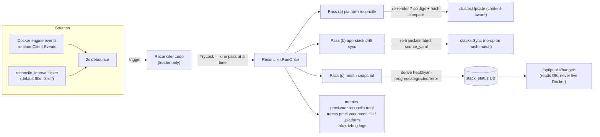
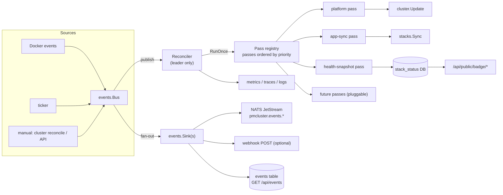

# Control loop — architecture & extension design

Status: current implementation live (v0.2.132–v0.2.135); this file describes the
loop as built AND the refactor target that makes it pluggable and able to push
events to an external stream for custom control loops.

## 1. How the loop works today (as-built)



Key properties:

- **Leader-only.** `WatchSwarmLeadership` channel starts/stops the loop and
  re-runs `ensureControlPlaneFresh` on promotion. Workers never run it.
- **Event + tick.** Docker events (create/update/die/kill...) arm a 2s debounce;
  the interval tick is the safety net. One pass at a time (TryLock skips).
- **Three passes per run.** (a) platform configs re-rendered + hash-compared +
  drifted stacks redeployed (no TLS/credential churn); (b) each app stack's
  latest source re-translated and synced when the rendered hash drifted;
  (c) per-stack + per-service health written to `stack_status`, stale rows pruned.
- **Reports, never acts on health.** No auto-restart/force-update; crash-loop
  retry is Swarm's restart-policy job.
- **Badges read the DB snapshot**, not live Docker — no flicker, no per-request
  swarm queries.

## 2. Extension goal

Two asks:

1. **Extendable passes** — adding a new reconcile behavior (health-gated
   rollback, alerting policy, registry GC...) must not touch the loop's core.
2. **External event stream** — everything the loop observes must be publishable
   to a separate stream (NATS / webhook / queryable log) so a third party can
   build their own control loop on top of pmcluster.

## 3. Target architecture



### 3.1 Pluggable passes

```go
// internal/reconcile (refactor target)
type PassContext struct {
    Store        *store.Store
    Docker       runtime.Client
    DeployService *stacks.Service
    Services     services.Service
    Update       func(ctx context.Context, deps cluster.UpdateDeps, in cluster.UpdateInput) (*cluster.UpdateResult, error)
    UpdateDeps   cluster.UpdateDeps
    UpdateInput  cluster.UpdateInput
    Log          zerolog.Logger
}

type Pass interface {
    Name() string                       // "platform" | "app_sync" | "health_snapshot" | ...
    Priority() int                      // ordering within a run
    Run(ctx context.Context, pctx *PassContext) error
}
```

- `Reconciler` becomes a thin runner: build `PassContext` → sort passes by
  priority → run each inside the run span → record per-pass outcome.
- Existing three passes extracted as-is; new policies are one new file.
- Trace structure becomes `pmcluster.reconcile` root + `pmcluster.reconcile.<pass>`
  child per registered pass (replaces the hard-coded platform child span).

### 3.2 Event stream

```go
// internal/events (new package)
type Event = runtime.Event // reuse the neutral model

type Sink interface {
    Name() string
    Publish(ctx context.Context, e Event) error
}

type Bus struct {
    mu      sync.Mutex
    subs    []chan Event   // in-process subscribers (Reconciler, sinks)
    sinks   []Sink         // external delivery
    log     zerolog.Logger
}
func (b *Bus) Publish(e Event)          // non-blocking fan-out
func (b *Bus) Subscribe() <-chan Event  // buffered in-process channel
func (b *Bus) AddSink(s Sink)
```

Sink implementations (selected by `events_sink` setting):

| Sink | Transport | Config |
|---|---|---|
| `none` (default) | — | behavior identical to today |
| `db` | `events` table (migration) + `GET /api/events?since=` (public/Bearer) | `events_sink=db` |
| `webhook` | HTTP POST JSON `{type,action,stack,service,node,timestamp}` | `events_sink=webhook`, `events_url`, optional HMAC via `events_secret` |
| `nats` | JetStream subject `pmcluster.events.<stack>` (durable consumer-ready) | `events_sink=nats`, `events_nats_url`, `events_nats_subject` |

- `runtime.Client.Events` feeds the Bus; the Reconciler subscribes via
  `Bus.Subscribe()` (so custom loops could subscribe too without a daemon restart).
- Publishing is non-blocking + drop-on-full-buffer (control loop must never be
  slowed by a slow sink); each sink gets its own bounded buffer + retry.
- Sink errors are logged (debug) and telemetry-counted
  (`pmcluster.events.published{source,sink}` / `pmcluster.events.dropped`).

### 3.3 Wiring (serve.go)

- Build `events.NewBus(log)`; wire `docker.Events` stream into it.
- Reconciler gets `Bus` (replaces direct `Docker.Events` read) + pass list.
- On leader promotion: start loop (subscribes to Bus) + start configured sinks;
  on loss: stop both.

## 4. Migration path (no behavior change until a sink is configured)

1. Extract `internal/events` (Bus + Sink + db/webhook/nats sinks, `events_sink`
   setting + allowlist).
2. Refactor Reconciler onto the Pass interface (same three passes, same order,
   same logging/metrics/traces — golden tests stay green).
3. Route loop triggers through the Bus (in-process subscribe replaces direct
   Docker.Events read).
4. Wire sinks in serve.go behind the setting.
5. Docs: this file + CHANGELOG.

## 5. What stays the same

- Leader-only execution, one-pass-at-a-time, event+tick triggers, no
  auto-restart semantics, DB-driven badges, errors-only history, deploy
  pipeline untouched.