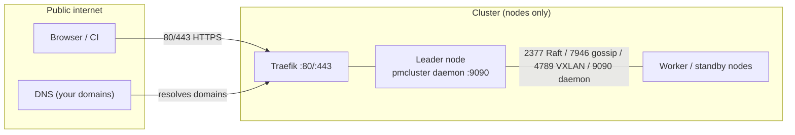
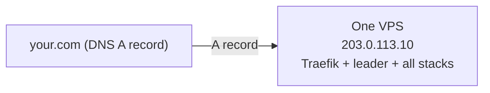
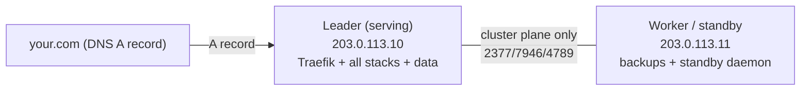
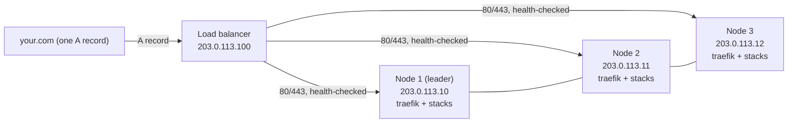
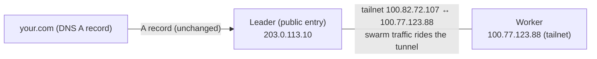
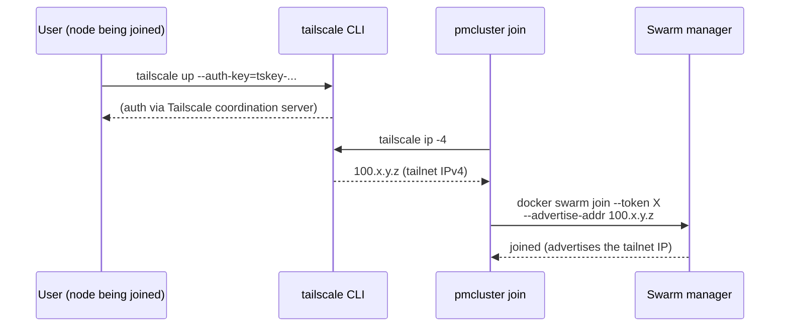
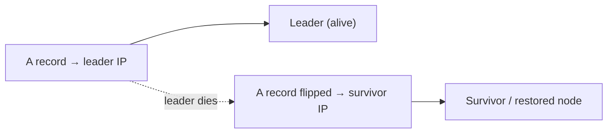

# Network topology & DNS routing

How pmcluster nodes connect to each other, what must be reachable from the
public internet, and how to point your domain at the cluster — from the
simplest single-node setup to a load-balanced multi-node HA layout.

## 1. The two traffic planes

Every pmcluster deployment has two distinct networks that people mix up:

| Plane | Purpose | Who talks on it | Encryption |
|---|---|---|---|
| **Public** (internet) | Browsers → Traefik (80/443); DNS resolution | Users / CI / your domains | TLS (HTTPS) |
| **Cluster** (node↔node) | Swarm Raft (2377), gossip (7946), overlay VXLAN (4789), daemon API (9090), optional storage/backup ports | The swarm nodes only | Raft/gossip TLS + overlay encryption |

**Key rule:** the *public* plane only ever reaches the node(s) that run
Traefik. The *cluster* plane must only be reachable between your own nodes —
never from the internet (firewall it, or run it over a private/tailnet link).



## 2. Topology options (pick one, in order of effort)

### Option A — single node (the poor-man default)
One VPS runs the Swarm leader, all platform stacks, and every app stack.



- **DNS:** one `A` record per domain pointing at the node's public IP.
- **Firewall:** only 22 (SSH), 80, 443 open to the internet; nothing else.
- **Good for:** the majority of deployments (a handful of apps on one box).
- **Downtime if the node dies:** full — recovery = restore backups on a fresh
  node (see `restore-design.md`). This is the accepted poor-man trade-off.

### Option B — multi-node, one serving node (leader + workers)
A Swarm leader holds Traefik + all stacks; workers/standby nodes hold
backups, standby daemons, and future capacity. App stacks stay **pinned** to
the leader (`placement: <hostname>` or the auto-pin to `platform_node`) so
their `/var/stack/data` volumes never migrate.



- **DNS:** still one `A` record per domain → the leader. The workers are
  invisible to the internet.
- **Firewall:** leader opens 22/80/443 to the internet + cluster ports to the
  worker's IP **only**. Worker opens only the cluster ports to the leader.
- **Good for:** backups off the serving box, standby capacity, adding a 2nd/3rd
  manager later.
- **Downtime if the leader dies:** same as Option A for the apps (data is on
  that disk) — the workers add *recovery speed*, not zero-downtime failover.

### Option C — multi-node HA with a load balancer (the "single IP" dream)
All nodes run Traefik; a load balancer (or DNS failover) fronts them; app
data is replicated (LINSTOR/DRBD under `/var/stack/data`) so any node can
serve any stack. **This is the only topology where the domain survives a node
loss without manual intervention — and it is the last step of an HA build,
not the first.**



- **DNS:** one `A` record → the LB IP (or a DNS-failover record).
- **Requires, in order:** (1) 3+ managers (quorum 2/3 so the swarm survives a
  loss), (2) data replication so the surviving nodes hold the volumes,
  (3) Traefik + edge running on every node, (4) the LB/DNS in front.
- **An LB alone does NOT give you HA** — it only redirects to whatever is
  actually running. Without steps 1–3 it will happily route users to a healthy
  node that has no copy of their data (see `storage-and-databases.md`).

### Option D — tailnet (Tailscale) instead of opening cluster ports
Joining nodes with `pmcluster join --tailscale` puts node-to-node traffic on a
private WireGuard tailnet, so **no firewall rules are needed between nodes** and
cluster traffic is encrypted end-to-end.



- **DNS:** unchanged — tailnet IPs (100.64.0.0/10) are **not** publicly
  routable; they never appear in DNS.
- **Firewall:** nodes only need 22/80/443 to the internet; cluster ports
  (2377/7946/4789) can be fully closed to the public — the tunnel carries them.
- **Good for:** multi-node clusters where opening ports between nodes is
  awkward; future 3rd-node joins with zero firewall choreography.
- **Limitations:** registry pulls still go out the public egress; tailnets do
  not fix provider-side blocks (e.g. a registry WAF).

#### What pmcluster does (and does not) do with Tailscale

**pmcluster has no Tailscale integration.** The `--tailscale` flag is a thin
automation of three trivial CLI calls — all the network work is done by the
`tailscale` binary itself:



1. `tailscale up --auth-key=...` — the authentication (nothing pmcluster-specific);
2. `tailscale ip -4` — read the node's tailnet IP;
3. pass that IP as `--advertise-addr` to `docker swarm join` / `docker swarm init`.

**The one non-obvious step is step 3.** `docker swarm join` without an
advertise-addr advertises the node's *first non-loopback IP* — the **public
IP**, not the tailnet IP. If you join with just the tailnet IP as the manager
address, the node still advertises its public IP and swarm node-to-node traffic
(Raft/gossip/VXLAN) keeps going over the public internet; the tailnet only
carried your join call. To actually make swarm traffic ride the tailnet the
joining node must advertise its tailnet IP — exactly what `--tailscale`
automates. You can do all of it by hand instead:

```bash
tailscale up --auth-key=tskey-...                    # you, manually
pmcluster cluster up --swarm-advertise-addr 100.x.y.z  # first node
docker swarm join --token X --advertise-addr 100.x.y.z <tailnet-manager>:2377
```

The flag is purely optional convenience — opt-in, dormant unless passed, and
completely replaceable by the three manual commands above.

## 3. Firewall reference (per option)

| Port | Protocol | Purpose | Open to |
|---|---|---|---|
| 22 | TCP | SSH (operator) | your admin IPs only |
| 80, 443 | TCP | Traefik — every public domain | the internet |
| 9090 | TCP | pmcluster daemon API | edge container (docker bridge) + your IPs; **not** the internet |
| 2377 | TCP | Swarm cluster management (Raft) | other swarm nodes only |
| 7946 | TCP/UDP | Node-to-node gossip | other swarm nodes only |
| 4789 | UDP | Overlay networks (VXLAN) | other swarm nodes only |
| 3370 / 7788–7799 | TCP | LINSTOR/DRBD (if used) | storage nodes only |

Options A/B: open 2377/7946/4789 **only to the specific peer node IPs**.
Option D: leave them closed to the public — the tailnet carries them.

## 4. Routing your DNS to the cluster

### The single record (options A, B, D)
For each domain you serve, add one record:

| Type | Name | Value |
|---|---|---|
| A | `your.com` | `203.0.113.10` (the serving node's public IP) |
| A | `app.your.com` | `203.0.113.10` |
| A | `pmcluster.your.com` | `203.0.113.10` |
| A | `observ.your.com` | `203.0.113.10` |
| A | `sso.your.com` | `203.0.113.10` |

Every domain that pmcluster creates a Traefik router for
(`app.<domain>`, `pmcluster.`, `observ.`, `traefik.`, `sso.`, aliases from
your manifests) points at the same serving IP. Wildcard `*.your.com` → the
same IP works if your DNS provider supports it.

### Manual failover (options A/B — cheapest, minutes of downtime)
Keep the single `A` record. When the serving node dies:

1. (If a standby manager exists) promote/restore — or restore app data on a
   fresh node from your backups (see `restore-design.md`).
2. Edit the `A` record(s) to the survivor's public IP.
3. Update the record for **every** domain (or use a wildcard).



### DNS failover service (automated A-record flip)
A DNS provider with health-check failover (or a small script on the standby
that probes the leader over the tailnet and flips the record) removes the
manual step. Same single-record model; the record follows the health check.

### Load balancer (option C — true single-IP HA)
One LB IP in front of every node's public IP:

| Type | Name | Value |
|---|---|---|
| A | `*.your.com` | `203.0.113.100` (the LB) |

The LB health-checks each node's 80/443 (Traefik on all of them) and forwards
only to healthy backends. This is the only setup where the domain genuinely
keeps working through a node loss **with zero manual steps** — provided the
data layer (step 2 of Option C) is solved too.

## 5. Decision guide

| Your situation | DNS approach | Cluster networking |
|---|---|---|
| One VPS | single A record → the node | nothing to open between nodes |
| Leader + workers, backups off-box | single A record → leader | cluster ports leader↔worker only, or tailnet |
| Want "domain survives node loss" | LB or DNS-failover record | **first** build 3 managers + data replication + traefik everywhere; then the LB |
| Adding nodes on hostile network paths | — | tailnet (`join --tailscale`) |

**The honest one-liner:** the domain should always point at *one* public entry
— either the single serving node (options A/B/D) or the load balancer
(option C). An LB is the **last** piece of an HA build, not the first; buying
one before the data layer exists buys you a redirect to nothing.