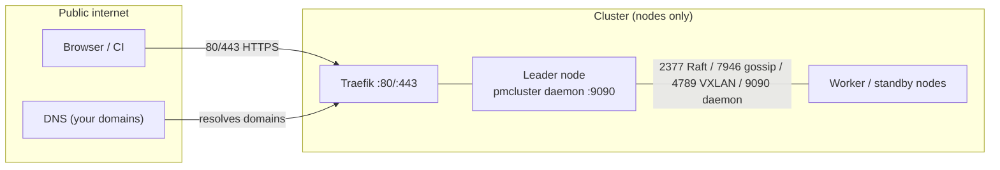
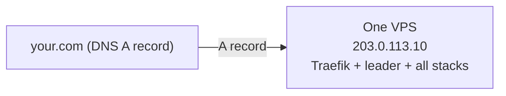
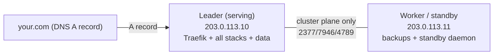
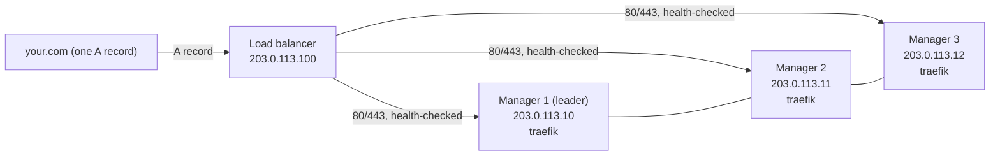
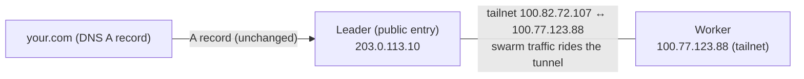
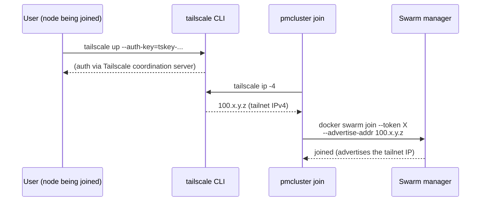
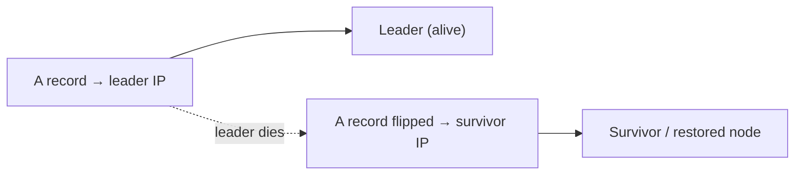

# Network topology & DNS routing

How pmcluster nodes connect to each other, what must be reachable from the
public internet, and how to point your domain at the cluster — from the
simplest single-node setup to a load-balanced multi-node HA layout.

## 1. The two traffic planes

Every pmcluster deployment has two distinct networks that people mix up:

| Plane | Purpose | Who talks on it | Encryption |
|---|---|---|---|
| **Public** (internet) | Browsers → Traefik (80/443); DNS resolution | Users / CI / your domains | TLS (HTTPS) |
| **Cluster** (node↔node) | Swarm Raft (2377), gossip (7946), overlay VXLAN (4789), daemon API (9090), optional storage/backup ports | The swarm nodes only | Raft/gossip TLS + overlay encryption |

**Key rule:** the *public* plane only ever reaches the node(s) that run
Traefik. The *cluster* plane must only be reachable between your own nodes —
never from the internet (firewall it, or run it over a private/tailnet link).



## 2. Topology options (pick one, in order of effort)

### Option A — single node (the poor-man default)
One VPS runs the Swarm leader, all platform stacks, and every app stack.



- **DNS:** one `A` record per domain pointing at the node's public IP.
- **Firewall:** only 22 (SSH), 80, 443 open to the internet; nothing else.
- **Good for:** the majority of deployments (a handful of apps on one box).
- **Downtime if the node dies:** full — recovery = restore backups on a fresh
  node (see `pmcluster/docs/restore-design.md`). This is the accepted poor-man
  trade-off.

### Option B — multi-node, one serving node (leader + workers)
A Swarm leader holds Traefik + the platform stacks + the stateful app data;
workers/standby nodes hold backups, standby daemons, and future capacity. App
stacks stay **pinned** (`placement: <hostname>`, or the storage-node auto-pin —
the leader is a storage node by default) so their volume-root data never
migrates.



- **DNS:** still one `A` record per domain → the leader. The workers are
  invisible to the internet.
- **Firewall:** leader opens 22/80/443 to the internet + cluster ports to the
  worker's IP **only**. Worker opens only the cluster ports to the leader.
- **Good for:** backups off the serving box, standby capacity, adding a 2nd/3rd
  manager later.
- **Downtime if the leader dies:** same as Option A for the apps (data is on
  that disk) — the workers add *recovery speed*, not zero-downtime failover.

### Option C — multi-node HA with a load balancer (the "single IP" dream)
All **manager** nodes run Traefik; a load balancer (or DNS failover) fronts
them; app data is kept highly available through pinned placement + backups +
`pmcluster stack move` (the platform's Path 1 decision — see
storage-and-databases.md; block replication such as LINSTOR/DRBD is explicitly
**off the roadmap**). **This is the only topology where the domain survives a
node loss without manual intervention — and it is the last step of an HA build,
not the first.** "Any node serves any stack" is delivered via restore/move
rather than a shared replicated device, so a node loss still means a
minutes-scale restore window for the stacks whose data lived on it.



**How Traefik is actually deployed here:** the infra stack runs Traefik as a
**`mode: global`** service constrained to `node.role == manager` — so **one
instance runs on every manager automatically** (3 managers → 3 running Traefik
instances from the start), and *no* instance runs on a worker. The manager
pinning is deliberate: Traefik's Swarm provider lists services through the
local Docker socket, which **only a manager node can read** — a global replica
that landed on a worker had no routers at all, and the ingress routing mesh
intermittently forwarded requests to that routerless replica (a real prod
outage: `pmcluster.<domain>` 404'd on ~half of requests). The **ingress
routing mesh** still fronts the gateway from *every* node: 80/443 are
published in `ingress` mode, so any node that receives traffic forwards it to
a Traefik task on a manager. Nothing is "spun up" when a manager dies: the
surviving managers' Traefik instances are already running and keep serving.

> **The LB/TLS limitation (per-node ACME behind a load balancer is not
> solvable from our side).** In ACME mode each Traefik instance runs its own
> Let's Encrypt HTTP-01 challenge listener on `:80`. Behind a load balancer the
> challenge request may be routed to a *different* manager's Traefik than the
> one that requested the certificate, so issuance fails nondeterministically.
> There is nothing pmcluster can do about this from inside the cluster — an LB
> in front of several independent ACME clients cannot be made to route the
> challenge to the right one. If you build Option C, use one of: an
> **operator-supplied wildcard certificate** (`cluster up --cert/--key`,
> rotated with `pmcluster tls site set`) replicated to every manager as
> versioned Swarm secrets; a **DNS-01 cert** issued outside the cluster and
> installed the same way; or a **terminating LB** that owns TLS and forwards
> plain HTTP to the nodes. Per-host customer certs (`pmcluster tls hosts`)
> have the same constraint.

- **DNS:** one `A` record → the LB IP (or a DNS-failover record).
- **Requires, in order:** (1) 3+ managers (quorum 2/3 so the swarm survives a
  loss), (2) the data story — pinned stateful stacks plus tested
  backup/restore (see `storage-and-databases.md`), (3) Traefik on every
  **manager** (the default global manager placement does this), (4) the
  LB/DNS in front — terminating TLS itself or fronting a BYO-cert cluster
  (see the limitation above).
- **An LB alone does NOT give you HA** — it only redirects to whatever is
  actually running. Without steps 1–2 it will happily route users to a healthy
  node that has no copy of their data (see `storage-and-databases.md`).

### Option D — tailnet (Tailscale) instead of opening cluster ports
Joining nodes with `pmcluster join --tailscale` puts node-to-node traffic on a
private WireGuard tailnet, so **no firewall rules are needed between nodes** and
cluster traffic is encrypted end-to-end.



- **DNS:** unchanged — tailnet IPs (100.64.0.0/10) are **not** publicly
  routable; they never appear in DNS.
- **Firewall:** nodes only need 22/80/443 to the internet; cluster ports
  (2377/7946/4789) can be fully closed to the public — the tunnel carries them.
- **Good for:** multi-node clusters where opening ports between nodes is
  awkward; future 3rd-node joins with zero firewall choreography.
- **Limitations:** registry pulls still go out the public egress; tailnets do
  not fix provider-side blocks (e.g. a registry WAF).

#### What pmcluster does (and does not) do with Tailscale

**pmcluster has no Tailscale integration.** The `--tailscale` flag is a thin
automation of three trivial CLI calls — all the network work is done by the
`tailscale` binary itself:



1. `tailscale up --auth-key=...` — the authentication (nothing pmcluster-specific);
2. `tailscale ip -4` — read the node's tailnet IP;
3. pass that IP as `--advertise-addr` to `docker swarm join` / `docker swarm init`.

**The one non-obvious step is step 3.** `docker swarm join` without an
advertise-addr advertises the node's *first non-loopback IP* — the **public
IP**, not the tailnet IP. If you join with just the tailnet IP as the manager
address, the node still advertises its public IP and swarm node-to-node traffic
(Raft/gossip/VXLAN) keeps going over the public internet; the tailnet only
carried your join call. To actually make swarm traffic ride the tailnet the
joining node must advertise its tailnet IP — exactly what `--tailscale`
automates. You can do all of it by hand instead:

```bash
tailscale up --auth-key=tskey-...                    # you, manually
pmcluster cluster up --swarm-advertise-addr 100.x.y.z  # first node
docker swarm join --token X --advertise-addr 100.x.y.z <tailnet-manager>:2377
```

The flag is purely optional convenience — opt-in, dormant unless passed, and
completely replaceable by the three manual commands above.

#### Tailscale caveats (read before relying on it)

1. **The tailnet CIDR must be allowed before the ufw catch-all DENYs.** The
   hardened-host firewall ([`harden-host.sh`](../harden-host.sh)) runs
   `ufw --force reset` and then `default deny incoming` — a blanket DENY that
   swallows tailnet traffic too. On a hardened node you must explicitly
   `ufw allow in on tailscale0` (or allow `100.64.0.0/10`) **after** the reset
   and before the catch-all takes effect, or the WireGuard handshake itself is
   dropped and the node silently falls off the tailnet.
2. **Prod does not advertise the tailnet IP.** Advertising the tailnet IPv4 is
   a *join-time* decision (`--tailscale` / `--advertise-addr`); nodes that
   joined advertising their **public** IP keep advertising it forever — a
   tailnet existing between the nodes does NOT reroute swarm traffic
   (Raft/gossip/VXLAN follow the advertised address). The production reference
   cluster runs exactly like this: the nodes share a tailnet for operator SSH,
   but swarm node-to-node traffic rides the public IPs, so the cluster ports
   must stay open between them. Making an existing cluster ride the tailnet
   means re-joining the Swarm with the tailnet address — not just installing
   Tailscale.

## 3. Firewall reference (per option)

| Port | Protocol | Purpose | Open to |
|---|---|---|---|
| 22 | TCP | SSH (operator) | your admin IPs only |
| 80, 443 | TCP | Traefik — every public domain (published `ingress`, reachable on every node, forwarded to a manager's Traefik task) | the internet |
| 9090 | TCP | pmcluster daemon API | the edge container (docker bridge) + your IPs; **not** the internet |
| 2377 | TCP | Swarm cluster management (Raft) | other swarm nodes only |
| 7946 | TCP/UDP | Node-to-node gossip | other swarm nodes only |
| 4789 | UDP | Overlay networks (VXLAN) | other swarm nodes only |
| 8333 | TCP | in-cluster SeaweedFS backup store — its S3 API is **published on the routing mesh** (`ingress`), so docker-proxy listens on 8333 on *every* node | cluster nodes only — restrict it (see below); it serves the failover restore and the store-transit mover via `127.0.0.1:8333` / `host.docker.internal:8333` |
| 4318 | TCP | OTel collector node-local OTLP (published `host` mode) | **not** the internet — a documented Traefik bypass, closed to the WAN by `harden-host.sh` |

Options A/B: open 2377/7946/4789 **only to the specific peer node IPs**.
Option D: leave them closed to the public — the tailnet carries them (but see
the caveats above).

### The hardened-host firewall model

[`harden-host.sh`](../harden-host.sh) (repo root, idempotent, Ubuntu 24.04+)
applies the reference hardening in one shot:

1. **ufw** — `default deny incoming`, `default allow outgoing`, and only
   22/80/443 open to the WAN. The FORWARD policy is set to ACCEPT because
   Docker programs its own chains and ufw's default DROP would break overlay
   networking and the swarm ingress.
2. **iptables DOCKER-USER rules** — close the ports Docker publishes that must
   NOT be public: 4318 (OTLP, the obvious Traefik bypass) and the host-bound
   control plane 9090/2377/7946 to the WAN, while the docker/overlay subnets
   (default `172.16.0.0/12`) keep talking. Peer nodes reach the swarm control
   plane via the `SWARM_PEERS=<ip,…>` env var (export it per node with the
   other nodes' IPs). **If the in-cluster backup store is enabled, add 8333 to
   `RESTRICTED_DOCKER_PORTS`** so the store stays cluster-internal — the
   failover/restore paths reach it through the routing mesh loopback, never
   through the public interface.
3. **fail2ban** for SSH brute-force defense, plus pending security updates.

Re-running is safe (chains are flushed first). When you re-run it on a
tailnet-using node, re-check caveat 1 above — the ufw reset re-applies the
catch-all DENY.

## 4. Routing your DNS to the cluster

### The single record (options A, B, D)
For each domain you serve, add one record:

| Type | Name | Value |
|---|---|---|
| A | `your.com` | `203.0.113.10` (the serving node's public IP) |
| A | `app.your.com` | `203.0.113.10` |
| A | `pmcluster.your.com` | `203.0.113.10` |
| A | `observ.your.com` | `203.0.113.10` |
| A | `sso.your.com` | `203.0.113.10` |

Every domain that pmcluster creates a Traefik router for
(`app.<domain>`, `pmcluster.`, `observ.`, `traefik.`, `sso.`, aliases from
your manifests) points at the same serving IP. Wildcard `*.your.com` → the
same IP works if your DNS provider supports it.

### Manual failover (options A/B — cheapest, minutes of downtime)
Keep the single `A` record. When the serving node dies:

1. (If a standby manager exists) promote/restore — or restore app data on a
   fresh node from your backups (see `pmcluster/docs/restore-design.md`).
2. Edit the `A` record(s) to the survivor's public IP.
3. Update the record for **every** domain (or use a wildcard).



### DNS failover service (automated A-record flip)
A DNS provider with health-check failover (or a small script on the standby
that probes the leader over the tailnet and flips the record) removes the
manual step. Same single-record model; the record follows the health check.

### Load balancer (option C — true single-IP HA)
One LB IP in front of every node's public IP:

| Type | Name | Value |
|---|---|---|
| A | `*.your.com` | `203.0.113.100` (the LB) |

The LB health-checks each node's 80/443 (Traefik on all of them) and forwards
only to healthy backends. This is the only setup where the domain genuinely
keeps working through a node loss **with zero manual steps** — provided the
data layer (step 2 of Option C) is solved too.

## 5. Decision guide

| Your situation | DNS approach | Cluster networking |
|---|---|---|
| One VPS | single A record → the node | nothing to open between nodes |
| Leader + workers, backups off-box | single A record → leader | cluster ports leader↔worker only, or tailnet |
| Want "domain survives node loss" | LB or DNS-failover record | **first** build 3 managers + data replication + traefik everywhere; then the LB |
| Adding nodes on hostile network paths | — | tailnet (`join --tailscale`) |

**The honest one-liner:** the domain should always point at *one* public entry
— either the single serving node (options A/B/D) or the load balancer
(option C). An LB is the **last** piece of an HA build, not the first; buying
one before the data layer exists buys you a redirect to nothing.