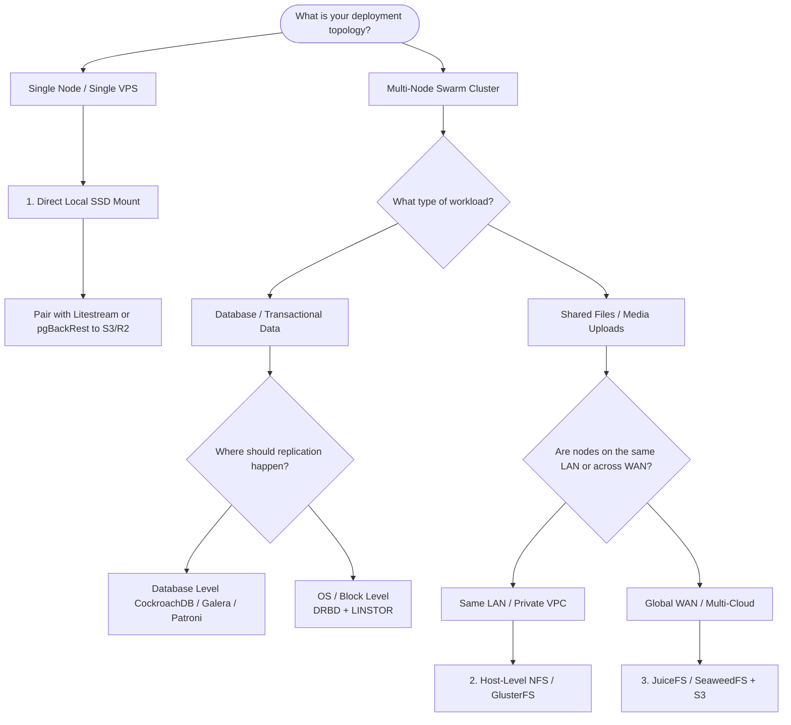
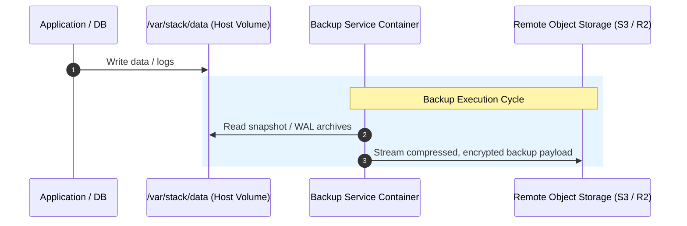

# 📦 Poor Man Stack: Storage & Database Architecture Guide

`Poor Man Stack` is designed to be lightweight, unopinionated, and highly cost-effective. Instead of locking you into a complex, resource-heavy distributed filesystem (like Kubernetes CSIs or Longhorn), the stack standardizes on a **single host root mount**:

```
/var/stack/data
```

How you configure, format, or replicate the underlying host storage at `/var/stack/data` is entirely up to you. Whether you choose a single $5/month VPS or a globally distributed multi-node cluster, this guide covers the supported storage options, database architectures, and backup strategies.

---

## 🧭 Storage Decision Flowchart

Use the flowchart below to choose the right storage paradigm for your workload:



---

## 🗄️ Database Architectural Strategies

When hosting databases without paying for expensive cloud-managed database services (RDS, Cloud SQL), choose one of the following approaches based on your consistency and availability needs.

### 1. Embedded / Lightweight Databases (SQLite)

If you want zero database complexity and ultra-low RAM usage (~20 MB):

* **SQLite + Litestream (Recommended):** Run SQLite on a local host volume inside `/var/stack/data`. **Litestream** streams Write-Ahead Log (WAL) changes continuously to cheap S3-compatible object storage (e.g., Cloudflare R2). If a node fails, the database restores automatically in seconds.
* **Distributed SQLite (rqlite / LiteFS):** Uses Raft consensus or FUSE page replication across nodes for live high availability without traditional database servers.

### 2. Native Cluster-Replicated Databases (CockroachDB / MariaDB Galera)

Instead of replicating storage disks at the OS level, let the database handle multi-node replication natively across standard local host mounts (`/var/stack/data`):

* **CockroachDB / YugabyteDB:** Distributed SQL databases using Raft consensus. Each node uses its own local SSD mount inside `/var/stack/data`. All nodes act as active, fault-tolerant gateways.
* **MariaDB Galera Cluster:** Multi-master synchronous replication where writes to any node's local disk sync instantly across the cluster over internal overlay networks.

### 3. Primary-Replica with Host-Level Block Replication (DRBD + LINSTOR)

If you run standard single-instance databases (PostgreSQL, MySQL) and need transparent, byte-for-byte block replication across low-latency private nodes:

* **DRBD + LINSTOR:** Acts as "RAID 1 over the network" inside the Linux kernel. It presents a synchronous block device (e.g., `/dev/drbd1000`) mounted at `/var/stack/data`. If Node 1 dies, Node 2 mounts the identical replicated disk with **0% data corruption risk**.

---

## 📊 Comprehensive Storage Matrix

| Engine / Option | Topology | Best For | DB Safe? | Operational Complexity |
| :--- | :--- | :--- | :---: | :---: |
| **Direct Local Host Mount** | Single Node | Single-server setups, SQLite + Litestream | **YES** | **Minimal (Default)** |
| **DRBD / LINSTOR** | Multi-Node (LAN) | PostgreSQL/MySQL block-level failover | **YES** | Medium (Host Kernel Modules) |
| **CockroachDB / Galera** | Multi-Node (Any) | Native DB-level multi-master consensus | **YES** | Low–Medium |
| **Host NFS / GlusterFS** | Multi-Node (LAN) | Concurrent shared file uploads (RWX) | **NO** | Low–Medium |
| **JuiceFS / SeaweedFS** | Global WAN | Multi-region shared storage backed by S3 | **YES** | Medium |

---

## 🛡️ Automated Backup Architecture & Rule

To ensure operational resiliency, `Poor Man Stack` provides an automated **Backup Container** service that backs up `/var/stack/data` offsite to S3-compatible object storage (Cloudflare R2, AWS S3, or Hetzner Storage Box).



### ⚠️ Critical Rule for Backup Containers in Replicated Environments

When deploying multi-node Swarm clusters:

1. **Independent Local Disks (Default):** Run the backup container on **all primary and standalone nodes** to ensure local snapshots of `/var/stack/data` are safely archived to S3/R2.
2. **Synchronous Replicated Disks (DRBD / LINSTOR / Shared Storage):** **DISABLE or PIN the backup container to the Primary Node ONLY.**
   * If DRBD/LINSTOR is active, Node 2's underlying block storage is an exact byte-for-byte clone of Node 1.
   * Running active backup jobs simultaneously on secondary nodes will cause resource contention, duplicate backup snapshots, or file lock conflicts.

---

## 🚀 Quickstart Example Stack

Here is an example `docker-stack.yml` showcasing the standardized `/var/stack/data` volume mount pattern:

```yaml
version: "3.8"

networks:
  public-ingress:
    external: true
  internal-net:
    driver: overlay

services:
  # Application Service using local shared uploads
  web:
    image: nginx:alpine
    networks:
      - public-ingress
      - internal-net
    volumes:
      - /var/stack/data/web-uploads:/usr/share/nginx/html/uploads

  # Primary Database using host root mount
  db:
    image: postgres:16-alpine
    environment:
      POSTGRES_DB: app
      POSTGRES_PASSWORD_FILE: /run/secrets/db_password
    networks:
      - internal-net
    volumes:
      - /var/stack/data/postgres:/var/lib/postgresql/data
    deploy:
      placement:
        constraints:
          - node.labels.db == true

  # Automated Offsite Backup Container
  backup:
    image: restic/restic:latest
    environment:
      RESTIC_REPOSITORY: "s3:https://<account-id>.r2.cloudflarestorage.com/backups"
      RESTIC_PASSWORD_FILE: "/run/secrets/restic_password"
    volumes:
      - /var/stack/data:/data:ro # Read-only mount of root stack data
    deploy:
      mode: replicated
      replicas: 1
      placement:
        constraints:
          - node.labels.db == true # Run backup strictly on primary node
```