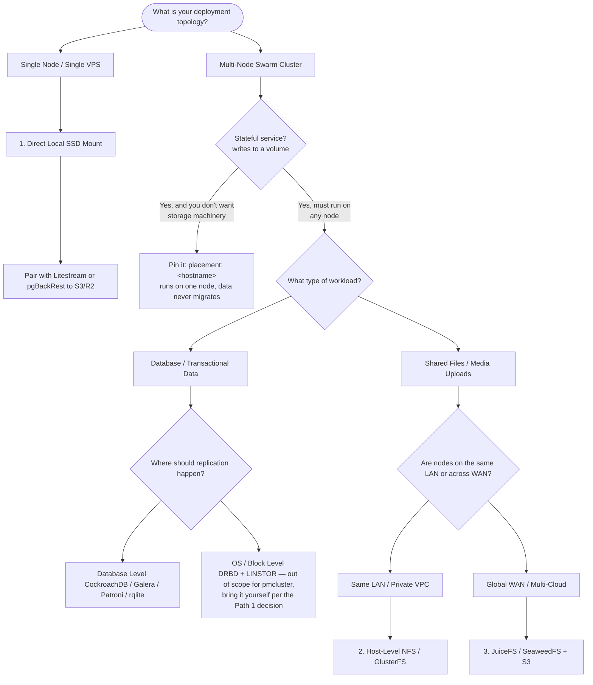
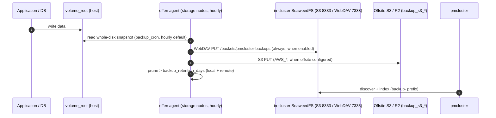

# Poor Man's Cluster: Storage & Database Architecture Guide

`Poor Man's Cluster` (pmcluster) is designed to be lightweight, unopinionated, and highly cost-effective. Instead of locking you into a complex, resource-heavy distributed filesystem (like Kubernetes CSIs or Longhorn), the stack standardizes on a **single host root mount**:

```
/var/stack/data          (default — override with the volume_root setting)
```

How you configure, format, or replicate the underlying host storage at the volume root is entirely up to you. Whether you choose a single $5/month VPS or a multi-node cluster, this guide covers the supported storage options, database architectures, and backup strategies.

> The volume root is a **setting**, not a hardcoded path: `pmcluster setup
> --volume-root` or `cluster settings set volume_root=…`. A blank stored value
> falls back to `/var/stack/data` everywhere (deploy, restore, the per-node
> volume-repair loop). Per-app paths are always derived from it —
> `<volume_root>/<app>/<volume>` — never hardcoded per app.

---

## The zero-effort rule: pin stateful services to a specific node

If you have a **stateful service** (anything that writes to a volume — a SQLite app, a database, a file store) and you **do not want to deal with storage replication, mirroring, or any of the machinery below**, the supported answer is deliberately simple:

> **Pin the service to one specific node with `placement: <hostname>`.**

That is the whole fix. The service runs on that one node forever, its volume-backed data lives under `<volume_root>/<app>/<name>` on that node and never has to migrate, and nothing else needs to be configured — no NFS, no DRBD, no LINSTOR, no mirroring cron, no distributed database. The hourly backup agents still cover it.

```yaml
services:
  db:                       # stateful: SQLite / Postgres / anything with a volume
    image: ghcr.io/you/db
    placement: node-01 # ← a SPECIFIC node hostname, not "manager"/"worker"
    volumes:
      - db_data:/var/lib/db
```

Why a specific node and not `manager` / `worker`?

* `placement: manager` means *any* manager — if you later add a second manager (or promote the worker), Swarm may reschedule the task onto the other node, where its volume root is empty → the app starts with fresh data or fails on a missing bind source.
* `placement: <hostname>` pins to exactly one machine. Swarm captures node hostnames at join time (`pmcluster join --hostname`), so the pin always refers to a real, stable name. `pmcluster node list` prints the available hostnames.
* Leaving `placement` empty is also safe for volume services: pmcluster **auto-pins** them to a storage node (see Path 1 below) instead of letting them float.

This is the recommended default for every stateful workload on the platform. Only reach for the replication strategies in this document when a service genuinely must be able to run on *more than one* node.

---

## Path 1 is the HA answer: pin + backup/restore (design decision)

**Path 1 — pinned placement + backup/restore — is the HA story for the platform.**
Block replication (LINSTOR/DRBD9) is **explicitly not** on the roadmap; see the
honest cost table below for why it was rejected as the 2026-10-02 directive's
default and replaced by Path 1.

**The decision (supersedes the earlier "LINSTOR is the HA prerequisite"
directive).** Stateful services pin to a node (explicit `placement: <hostname>`,
the `storage_nodes` round-robin, or the `platform_node` fallback), their data
lives node-locally under the volume root, and the hourly backup agents plus
on-demand pre-deploy backups cover it. Multi-manager HA protects the Swarm
control plane (via the Raft-replicated state configs); data HA comes from
**backup + restore + `stack move`**, not from block replication.

**How the platform operationalizes Path 1:**

- **`storage_nodes` setting** — comma-separated hostnames; stateful stacks
  (services with volumes and no explicit placement) round-robin deterministically
  across them (FNV-1a of the stack name). Explicit `placement:` always wins; a
  per-stack pin written by `pmcluster stack move` outranks the round-robin; the
  `platform_node` setting (which **defaults to the leader** on update/up) is the
  single-node fallback when `storage_nodes` is empty.
- **The leader is always a storage node** — `cluster up` seeds the leader's
  hostname into `storage_nodes`, and every `cluster update` re-adds the current
  leader (the backup agent and the edge console run there). Storage follows
  leadership: a manager that *loses* leadership is removed from
  `storage_nodes` and its `pmcluster.storage` node label is cleared (the
  promoted leader is remembered in the internal `storage_leader` setting).
- **`pmcluster join --storage-node` / `pmcluster node promote|demote <hostname>`**
  — add or remove a storage node. Workers qualify — storage is not
  leader-only. `join --storage-node` stamps the swarm-visible
  `pmcluster.storage` node label (it has no path to the leader's store), and the
  leader's next `cluster update` **adopts** any labeled-but-unlisted node into
  `storage_nodes`; demotion goes through `node demote` (which clears the label
  and the setting, and refuses to demote the current leader).
- **`io.pmcluster.node` label** — every deployed service carries a label naming
  the node its placement pin targets (a resolved storage node or an explicit
  hostname pin; role-based and unconstrained services carry none). The console
  Services table, the stack-detail services panel, and `pmcluster service ps`
  display this node, so you can see at a glance where every stateful service
  runs.
- **Outage pause (control loop)** — when a pinned storage node is down (absent
  from the swarm, `Status != ready`, or `Availability != active`), the reconcile
  loop **skips syncing/deploying** stacks pinned to it and logs a throttled
  warning; it clears automatically when the node returns or the stack is moved.
- **Automatic failover (opt-in)** — with `storage_failover=true` and offsite
  backups configured, the control loop instead moves the stack to a healthy
  alternate storage node, restoring the failed node's latest archive from the
  object store (5-minute per-stack cooldown). The move leaves a failover marker:
  the badge reads `failover` (amber) until `pmcluster stack ack <stack>` — or a
  move back — clears it. Without the setting the loop only alerts
  (`pmcluster.storage.node.down` / `pmcluster.storage.failover.disabled` OTel
  metrics).
- **`pmcluster stack move <stack> --to <node>`** — the manual data-migration
  story Path 1 gives operators for node maintenance / failure (see the mover
  below).

**Why not LINSTOR (the honest cost that rejected it):**

| Cost center | What it actually costs |
| :--- | :--- |
| LINSTOR controller | JVM, ~0.5–1 GB RAM, and it needs its own HA (embedded etcd) |
| Per-node satellites | ~50–150 MB each + DRBD9 kernel module (DKMS — rebuilds on kernel updates, needs kernel headers) |
| Disk provisioning | Builds LVM thin pools — must **NEVER** auto-provision on a live disk without explicit operator confirmation of the target device |
| Failure mode: footprint | ~1 GB RAM consumed before any app data is stored |
| Failure mode: complexity | DRBD/LVM complexity with zero benefit on a single node |
| Failure mode: operational | A replicated device is a second copy to keep consistent — and still needs the backup pipeline on top |

For the target deployments (single VPS, or a small multi-node swarm), Path 1's
pinned placement + hourly backups + on-demand `stack move` delivers the same
recovery outcomes (restore onto any node from the archive, or move live) at a
fraction of the footprint and with no kernel modules. Revisit block replication
only if a workload genuinely cannot tolerate a minutes-scale restore window.

---

## Storage Decision Flowchart

Use the flowchart below to choose the right storage paradigm for your workload:


```mermaid
flowchart TD
    Start([What is your deployment topology?]) --> SingleNode[Single Node / Single VPS]
    Start --> MultiNode[Multi-Node Swarm Cluster]

    %% Single Node Branch
    SingleNode --> LocalMount[1. Direct Local SSD Mount]
    LocalMount --> BackupLitestream[Pair with Litestream or pgBackRest to S3/R2]

    %% Multi Node Branch
    MultiNode --> Stateful{Stateful service?<br/>writes to a volume}
    Stateful -->|Yes, and you don't want<br/>storage machinery| Pin[Pin it: placement: &lt;hostname&gt;<br/>runs on one node, data never migrates]
    Stateful -->|Yes, must run on<br/>any node| WorkloadType{What type of workload?}

    WorkloadType --> DBWorkload[Database / Transactional Data]
    WorkloadType --> SharedFiles[Shared Files / Media Uploads]

    %% DB Workload Branch
    DBWorkload --> DBEngineChoice{Where should replication happen?}
    DBEngineChoice --> DBLevel[Database Level <br/>CockroachDB / Galera / Patroni / rqlite]
    DBEngineChoice --> OSLevel[OS / Block Level <br/>DRBD + LINSTOR — out of scope for pmcluster,<br/>bring it yourself per the Path 1 decision]

    %% Shared Files Branch
    SharedFiles --> NetworkType{Are nodes on the same LAN or across WAN?}
    NetworkType --> LAN[Same LAN / Private VPC]
    NetworkType --> WAN[Global WAN / Multi-Cloud]

    LAN --> HostNFS[2. Host-Level NFS / GlusterFS]
    WAN --> JuiceFS[3. JuiceFS / SeaweedFS + S3]
```

---

## Database Architectural Strategies

When hosting databases without paying for expensive cloud-managed database services (RDS, Cloud SQL), choose one of the following approaches based on your consistency and availability needs. These are **bring-your-own** patterns for the apps you deploy — pmcluster places and backs them up; the replication is the workload's own.

### 1. Embedded / Lightweight Databases (SQLite)

If you want zero database complexity and ultra-low RAM usage (~20 MB):

* **SQLite + Litestream (Recommended):** Run SQLite on a local host volume inside the volume root. **Litestream** streams Write-Ahead Log (WAL) changes continuously to cheap S3-compatible object storage (e.g. Cloudflare R2). If a node fails, the database restores automatically in seconds.
* **Distributed SQLite (rqlite / LiteFS):** Uses Raft consensus or FUSE page replication across nodes for live high availability without traditional database servers. rqlite speaks an HTTP API (`POST /db/execute?q=…`), so an app must talk to it over HTTP rather than opening a SQLite file — the replication happens inside the engine, on node-local volumes, so **no shared storage is needed**.

### 2. Native Cluster-Replicated Databases (CockroachDB / MariaDB Galera)

Instead of replicating storage disks at the OS level, let the database handle multi-node replication natively across standard local host mounts:

* **CockroachDB / YugabyteDB:** Distributed SQL databases using Raft consensus. Each node uses its own local SSD mount inside the volume root. All nodes act as active, fault-tolerant gateways.
* **MariaDB Galera Cluster:** Multi-master synchronous replication where writes to any node's local disk sync instantly across the cluster over internal overlay networks.

### 3. Primary-Replica with Host-Level Block Replication (DRBD + LINSTOR)

**Out of scope for pmcluster** (the Path 1 decision): the platform does not
deploy, configure or support DRBD/LINSTOR. If you run it yourself on the hosts,
know the costs: the LINSTOR controller is a JVM (~0.5–1 GB RAM) plus per-node
satellites and the DRBD9 kernel module, two extra firewall ranges
(`3370/tcp`, `7788–7799/tcp`) between the node IPs, and it does not remove the
need for the backup pipeline. Raw DRBD9 without LINSTOR is lighter (~150 MB)
but requires manual resource management. Everything else in this document
(pin, backup, restore, move) works identically on top of it.

---

## How pmcluster enforces the layout

The DSL and deploy pipeline **force every container volume under the volume root**, so the storage story is enforced, not aspirational:

* **`volume_root` setting** — a single host directory (default `/var/stack/data`), configurable via `pmcluster setup --volume-root` or `pmcluster cluster settings set volume_root=…`. Changing it re-creates the new root on every update (a missing bind source is rejected by Swarm), and every node's daemon ensures the root + backup dir exist locally at startup.
* **Named volumes** are auto-collected from service mounts (`db_data:/var/lib/postgresql/data`) and declared with `driver_opts: {type: none, o: bind, device: <root>/<app>/<name>}` — Docker's first-use ownership copy still runs for DB images, so Postgres/MySQL initialize correctly.
* **Host bind mounts** (`/host/config:/etc/app/config`) are relocated to `<root>/<app>/<basename>`. Raw `binds:` entries (docker.sock, /etc/localtime, sockets, device paths) are the deliberate exception — emitted verbatim, never relocated.
* **Every volume — named or bind — lands under `<root>/<app>/…`**, and no app can reach another app's data through pmcluster (raw `docker stack deploy` bypasses this, but that user is root on the host already). Volumes declared in the manifest's top-level `volumes:` map (a platform-stack feature) pass through verbatim instead.
* A per-node **volume-repair loop** in every daemon recreates missing bind-source directories for the stateful services the Swarm placed on that node (a task whose bind source is missing never starts) — it runs on standby managers and workers too, not just the leader.

---

## Comprehensive Storage Matrix

| Engine / Option | Topology | Best For | DB Safe? | Operational Complexity |
| :--- | :--- | :--- | :---: | :---: |
| **Direct Local Host Mount** | Single Node | Single-server setups, SQLite + Litestream | **YES** | **Minimal (Default)** |
| **CockroachDB / Galera / rqlite** | Multi-Node (Any) | Native DB-level multi-master consensus | **YES** | Low–Medium |
| **Host NFS / GlusterFS** | Multi-Node (LAN) | Concurrent shared file uploads (RWX) | **NO** | Low–Medium |
| **JuiceFS / SeaweedFS** | Global WAN | Multi-region shared storage backed by S3 | **YES*** | Medium |

\* JuiceFS/SeaweedFS are S3-data-path filesystems, not NFS; single-writer SQL on them still needs care (metadata server + object store), so treat them as safe only for single-writer workloads — same rule as any shared filesystem. (The in-cluster SeaweedFS instance pmcluster ships is a **backup store**, not a shared-data-plane for databases — see below.)

---

## Automated Backup Architecture

pmcluster's backup stack (a platform DSL manifest, `platform: true`) has three
components: **offen/docker-volume-backup agents**, an **in-cluster SeaweedFS
object store**, and an optional **offsite S3/R2 destination**.

### The backup agents (offen/docker-volume-backup)

* **Volume agent** — `mode: global` constrained to `pmcluster.storage`-labeled
  nodes when `storage_nodes` is set (one agent per storage node — the leader
  always qualifies); `mode: global` on **every** node when `backup_all_nodes`
  is true; otherwise a single replica pinned to the platform node / manager.
* **Schedule** — the `backup_cron` setting (standard 5-field cron), **default
  hourly** (`0 * * * *`) so the newest archive is never more than an hour old —
  that archive is what the storage-failover path restores. Set `0 3 * * *` for
  a daily 03:00 cadence.
* **Source** — the volume root (read-only): every app's data under
  `<volume_root>` in one whole-disk tarball named
  `backup-<nodeID>-<timestamp>.tar.gz`.
* **Retention** — `backup_retention_days` (default **15**): the agent prunes
  both the local archives and the remote copies (`BACKUP_PRUNING_PREFIX` /
  `BACKUP_RETENTION_DAYS`), and pmcluster prunes audit rows + archive files
  older than the window on every list.
* **Control-plane agent** — a second, manager/platform-node-pinned offen agent
  (daily 03:00, 30-day retention, `pmcluster-ctlplane-` prefix) that archives
  `~/.pmcluster` itself: `data.db` + `.encryption_key` + `config.yaml` (+ the
  rendered config tree). It is also uploaded to the store/offsite target, so a
  lost manager disk does not mean a full re-bootstrap.

### The in-cluster SeaweedFS store (S3 :8333 + WebDAV :7333)

When enabled (the `seaweedfs_admin` managed credential — self-healed by
`cluster update` on older clusters), the backup stack runs a headless
**SeaweedFS** server (`chrislusf/seaweedfs:4.48`) as the in-cluster object
store:

* **S3 API on :8333, published on the swarm routing mesh** — reachable at
  `127.0.0.1:8333` on *every* node, so the leader daemon (failover restore,
  `backup restore --from-s3`, store discovery) and the store-transit mover read
  it with no cross-node host ports. Keep it cluster-internal (restrict the
  published port — see [network-topology.md](network-topology.md)).
* **WebDAV gateway on :7333, cluster-internal only** — the *write* leg: offen's
  WebDAV backend creates the bucket path on first PUT (the S3 API does not
  auto-create buckets), so agents always write to the store via WebDAV.
* **Pinned to a non-storage, non-platform node** — chosen at render time as the
  first non-storage **worker**, else the first non-storage node, else (last
  resort, degraded) the platform node; the `backup_store_on` setting pins it to
  the **leader** instead when set to `leader`. The durable copy deliberately
  lives in a different failure domain than both the data and the platform
  stack. Data sits in a plain named volume (`seaweeddata`) — a real disk, never
  tmpfs. Buckets auto-create on first upload; credentials come from the
  `seaweedfs_admin` managed credential (S3 identity via env, auto-promoted to
  admin; no config file, no bootstrap).
* **Discovery** — the daemon indexes the store (S3 ListObjectsV2, `backup-`
  prefix, control-plane archives **deliberately excluded**) alongside the local
  archive dir, so `pmcluster backup list` and the console see archives other
  nodes uploaded. Nothing is ever deleted from the store by discovery.

### The offsite double-write (AWS_* + WEBDAV_*)

When the `backup_s3_*` settings (endpoint, bucket, access key, secret key,
optional region — R2/IONOS/AWS/any S3-compatible) are configured, each offen
agent writes **every archive twice**: to the in-cluster store via WebDAV
(`WEBDAV_URL`/`WEBDAV_PATH`/`WEBDAV_USERNAME`/`WEBDAV_PASSWORD`) **and** to the
offsite target via its native S3 backend (`AWS_S3_BUCKET_NAME`, `AWS_ACCESS_KEY_ID`,
`AWS_SECRET_ACCESS_KEY`, `AWS_ENDPOINT` + `AWS_ENDPOINT_PROTO`,
`AWS_S3_BUCKET_LOOKUP: path`). offen's own pruning keeps both copies in
lockstep — there is no separate replicator service. Store-only clusters use
the WebDAV leg only; offsite-only clusters fall back to a single S3 write.


```mermaid
sequenceDiagram
    autonumber
    participant App as Application / DB
    participant Disk as volume_root (host)
    participant Agent as offen agent (storage nodes, hourly)
    participant Store as in-cluster SeaweedFS (S3 8333 / WebDAV 7333)
    participant S3 as Offsite S3 / R2 (backup_s3_*)

    App->>Disk: write data
    Agent->>Disk: read whole-disk snapshot (backup_cron, hourly default)
    Agent->>Store: WebDAV PUT /buckets/pmcluster-backups (always, when enabled)
    Agent->>S3: S3 PUT (AWS_*, when offsite configured)
    Agent->>Agent: prune > backup_retention_days (local + remote)
    pmcluster->>Store: discover + index (backup- prefix)
```

### Restores

* **`pmcluster backup restore <id>`** — extracts a SUCCEEDED stack-scoped run
  under `<volume_root>/<stack>` (the archive's `/backup/data` prefix is
  stripped; control-plane archives are refused into the volume root). `--volume
  <name>` narrows to one volume; `--from-s3` forces the fetch from the **offsite**
  `backup_s3_*` bucket instead of the in-cluster store / local disk.
* **Routed to the OWNING node** — a stack's volume lives on its pinned storage
  node; when the CLI runs elsewhere, the restore is routed there through the
  same store-transit mover used by `stack move` (rclone pulls the archive from
  the store's published ingress and unpacks it into the owning node's volume
  root). When routing is impossible it fails loudly ("this stack's volume
  lives on `<node>` — run the restore there") rather than silently restoring
  into the wrong node. Single-node clusters keep the local path unchanged.
* **`cluster down --purge` safety net** — the purge first writes a restorable
  `purge-backup-<ts>.tar.gz` (data.db + .encryption_key + config.yaml) into the
  data dir and **keeps** it, then deletes the local store; `pmcluster cluster
  reset --restore <archive>` extracts it back before rebuilding the Swarm side
  from the DB.
* **`pmcluster cluster reset`** — non-destructive rebuild of the whole Swarm
  side (networks, secrets, configs, platform stacks, storage labels) from the
  local SQLite store; the DB is the source of truth and the Swarm is derived.

See `pmcluster/docs/restore-design.md` for the full restore design.

### Moving data between nodes (`stack move`, failover, and the store-transit mover)

`pmcluster stack move <stack> --to <node>`: trigger a fresh whole-disk backup →
transit the stack's subtree to the target → write the `stack_pin_<stack>`
setting (which outranks the round-robin) → re-deploy. The **store-transit
mover** is the transit path on clusters with the object store configured: a
one-shot swarm service pinned to the target pulls the archive **object**
straight from the store via the published loopback ingress
(`host.docker.internal:8333` — no cross-node host ports, no firewall rules),
verifies the tarball actually contains the stack's data before touching the
target, and unpacks `<stack>/` into the target's volume root. The storage
failover path uses the same mover, but pulls the **failed node's** newest
archive (never another node's) and never triggers a fresh backup first. A
fallback ephemeral-HTTP mover serves the archive from this host when no store
is configured. The source node's old subtree is intentionally left in place as
a safety net until you prune it.

---

## Quickstart: A pmcluster-managed database stack

This is the same pattern as the architecture above, expressed as a pmcluster **DSL manifest** (see [dsl.md](dsl.md)) — volumes land under `<volume_root>/<app>/<name>` automatically:

```yaml
app: myapp
env: production
domain: myapp.example.com
services:
  db:
    image: postgres:16-alpine
    env:
      POSTGRES_DB: "config(db_name)"
      POSTGRES_PASSWORD: "secret(db_password)"    # injects the stored secret's VALUE
    volumes:
      - db_data:/var/lib/postgresql/data
    healthcheck: { type: pg_isready }
  web:
    image: ghcr.io/acme/myapp
    expose:
      port: 8080
      host: myapp.example.com
    env:
      DATABASE_URL: "secret(myapp_database_url)"   # a stored secret holding the full connection string
```

* `db_data` is auto-declared and lands at `<volume_root>/myapp/db_data` (via `driver_opts: none/bind`), so Postgres initializes correctly.
* `db` has no `expose` → it gets no Traefik router and stays on the app's private overlay network, reachable only at `db:5432` (the compose service name resolves on the stack's network; the fully-qualified swarm name `myapp_db` works too).
* DB-backed references resolve from the pmcluster store at deploy time — the manifest never carries secrets. References are **whole-value** env entries: `config(db_name)` injects a stored config's content, `secret(myapp_database_url)` injects a stored secret's value (as in the example — for a composed connection string, store the whole URL once), and `secrets(name)` resolves to a file mount path (`/run/secrets/<name>`, the secret must also be listed in the service's `secrets:` array). There is no inline/substring interpolation inside a larger env value.
* The hourly volume agents back up `<volume_root>` — `myapp` rides along automatically; pre-deploy snapshots are opt-in via `backup_before_deploy: true` (+ `strict_backup: true` to abort the deploy if the backup fails).

**BYO backup tooling** (e.g. `restic/restic`): perfectly fine as a replacement
for the platform's offen agent, but it is *your* service — the platform's
discovery, retention, restore, move and failover paths only know about archives
the shipped agents write (local archive dir + the store/offsite objects). If
you bring your own, you also bring your own restore story.
